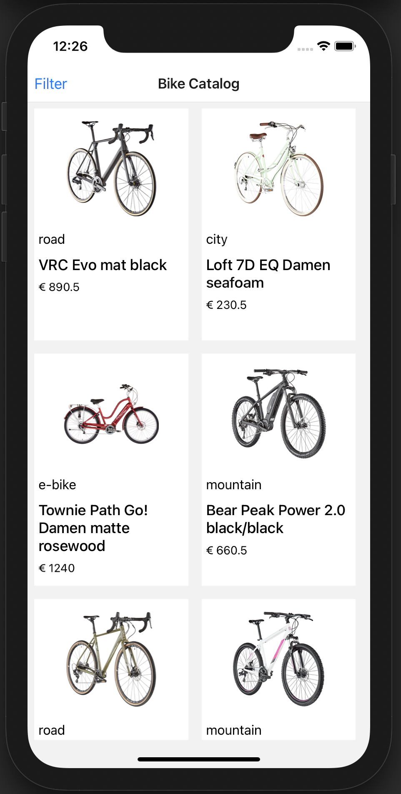
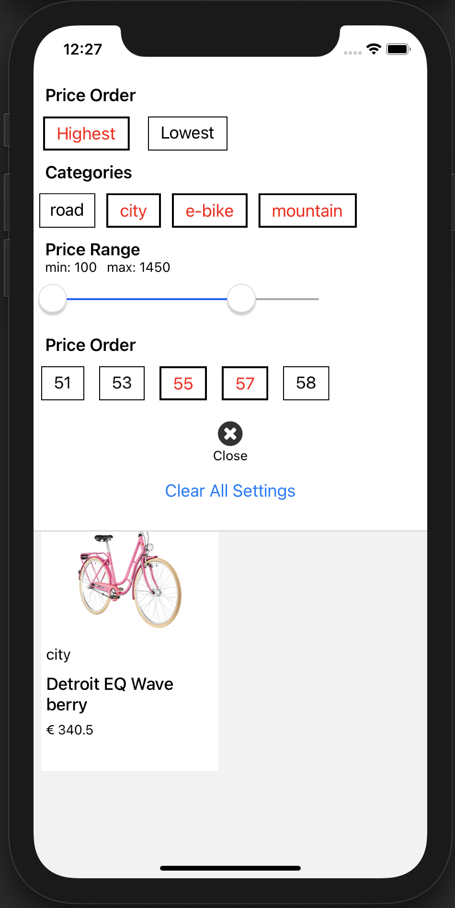
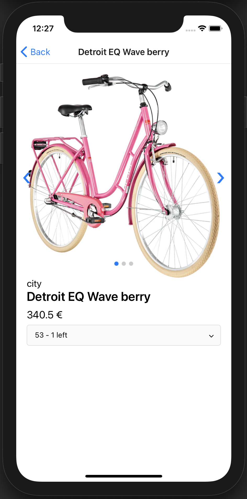

# Bike Catalog App 🚴‍♀️

This is Bike Catalog App that shows list of bikes.  
You can filter and sort bikes on the filter setting, and each bike has a detailed view that provides more info about the bike. Enjoy! 🚀

<div style="display: flex">
  <div>
    
  </div>
  <div>
    
  </div>
  <div>
    
  </div>
</div>

## Getting Started

#### Requirement
Node.js v12.14.1

#### 1. Clone and Install

```bash
# Clone the repo
git clone https://github.com/youxiberlin/bike-catalog-mobile.git

# Navigate to clonned folder and Install dependencies
cd bike-catalog-mobile
yarn || npm i

```

#### 2. Open in your simulator

Run this command to start the development server and to start your app on iOS simulator:

```
yarn run:ios || npm run:ios
```

on Android simulator:
```
yarn run:android || npm run:android
```

### Notes:
#### Main technologies & framework
Node.js, JavaScript, React Native, Expo

#### Data model
As defined on `./models/bike.js`, each bike data has these properties: `id, name, category, price, size, images`

The bike data that I used for this app can be found in `./data`

#### Tested Devices
iPhone SE, iPhone 8, iPhone12 mini, Pixel 4


